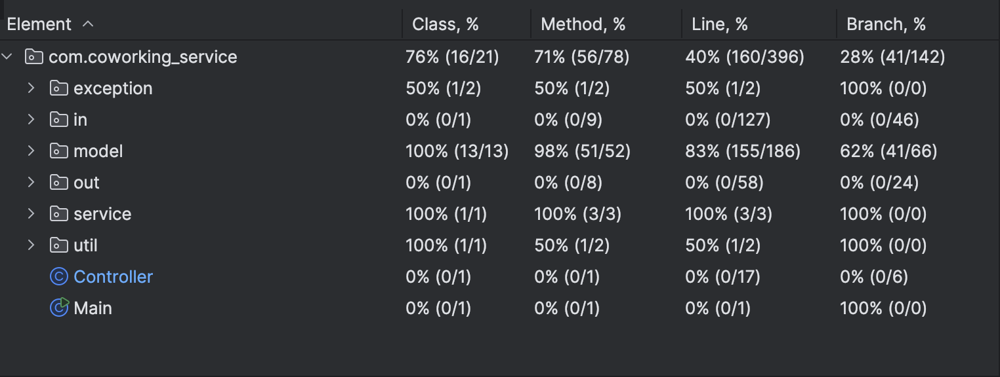
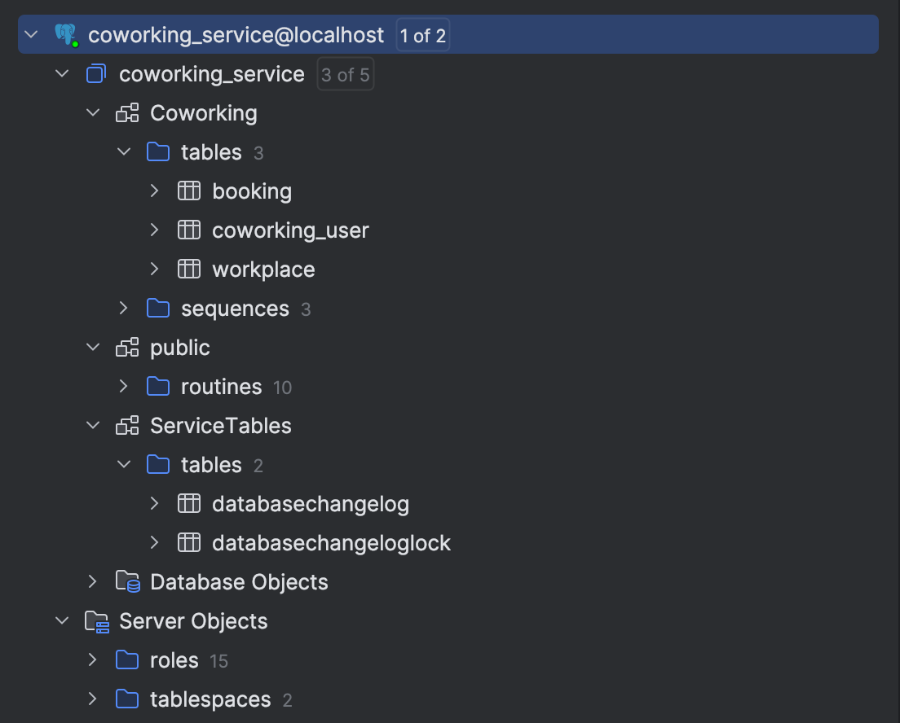
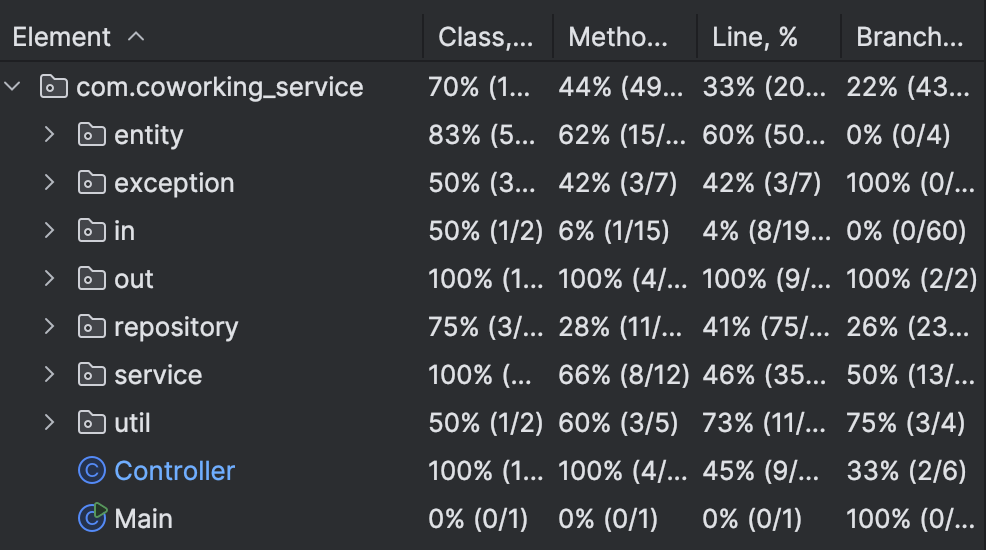

# homework_Ylab
Домашние работы, выполненные в рамках прохождения обучения на [платформе Ylab](https://learning-platform.ylab.website/my-homeworks/26). 

Homework assignments completed as part of the training on the [Ylab platform](https://learning-platform.ylab.website/my-homeworks/26).
***
1. [homework #1](https://github.com/darmsteter/homework_Ylab/pull/1)
2. [homework #2](https://github.com/darmsteter/homework_Ylab/pull/2)
3. homework #3
4. homework #4
5. homework #5

***

# homework 1
Для сборки приложения: 
`./gradlew jar`

Для запуска приложения: 
`java -cp build/libs/homework_Ylab.jar com.coworking_service.Main`

Стек:  
java 17.0  
Система сборки gradle

---
Профиль с правами администратора: 
login: `admin`  
password: `admin`

* Логин и команды, вводимые пользователем, не чувствительны к регистру.
* Пароль чувствителен к регистру. 
* Любой пользователь создается с правами обычного пользователя. Для проверки прав администратора используется профиль admin.
* При повторной аутентификации необходимо ввести логин и пароль дважды. [Ошибка, которую необходимо исправить.]

***

# homework 2

POSTGRES  
user: `user`  
password: `12345`  
db_name: `coworking_service`  

Перейдите из корня проекта в папку docker, затем запустите docker compose  
`docker-compose up`  

* Создание схем и таблиц в базе данных, а также предзаполнение данных выполняются инструментом миграции Liquibase. 
* Служебные таблицы хранятся в схеме ServiceTables, таблицы сущностей в схеме Coworking.
* Идентификаторы при сохранении в базу данных создаются через sequence.
* Вся логика присутствовавшая в проекте переписана для работы с базой данных. Профиль с правами администратора продублирован из ДЗ #1.

